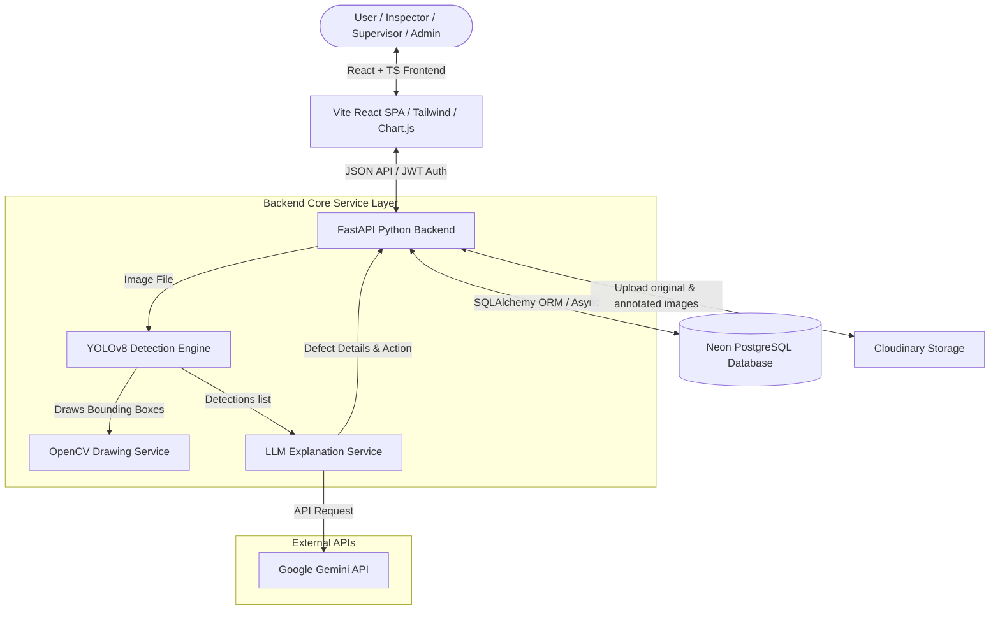

# FactoryVision AI 🏭👁️

> **AI-powered manufacturing quality inspection platform** for real-time defect detection, defect analytics, and production quality monitoring. Designed for high-throughput factory lines (Tesla Gigafactory simulation).

---

## Architecture Diagram

Below is the conceptual architecture of the FactoryVision AI system:



---

## Tech Stack

* **Frontend**: React (Vite), TypeScript, Tailwind CSS, React Router, Chart.js / React-Chartjs-2, Lucide Icons.
* **Backend**: FastAPI (Python), Uvicorn, Pydantic, SQLAlchemy (Async).
* **AI/CV Engine**: YOLOv8 (Ultralytics), OpenCV, PyTorch, Google Gemini LLM API.
* **Database**: PostgreSQL (Production: Neon DB, Local: SQLite fallback via `aiosqlite`).
* **Cloud Storage**: Cloudinary (for original and bounding-box annotated inspection images).
* **Containerization**: Docker, Docker Compose.
* **CI/CD**: GitHub Actions.

---

## Core Features

1. **Role-Based Authentication (RBAC)**:
   * **Inspector**: Conducts inspections, captures webcam feeds, and uploads component photos.
   * **Supervisor**: Read-only log access + full report compilation, csv/pdf generation, and custom products/lines registration.
   * **Admin**: All supervisor actions + operator key management.
2. **Quality Scanner**:
   * Drag-and-drop file upload.
   * Native HTML5 webcam stream capture with camera guidelines overlay.
   * YOLOv8 bounding box annotations and confidence level scoring.
   * Asynchronous Gemini LLM explanation describing the defect type, potential factory causes, and suggested corrective action.
3. **Production Analytics Dashboard**:
   * Live aggregates: Yield Pass Rate, Failure/Alarm rates, Model confidence, and throughput.
   * Pareto defect frequency and Line-by-Line reliability graphs.
   * Shift quality yield distribution and matrix heatmap grids.
4. **Report Compiler**:
   * Filter historical logs by Shift, Line, Status, and SKU.
   * Compile on-demand spreadsheet reports (CSV) and printable paper sheets (styled HTML/PDF).

---

## Folder Structure

```text
factoryvision-ai/
├── .github/workflows/         # GitHub Actions CI workflow config
├── ai/
│   └── detector.py            # YOLOv8 + OpenCV defect drawing engine
├── backend/
│   ├── static/                # Local static directory for reports and images fallback
│   ├── tests/                 # Full backend pytest integration suite
│   ├── auth_routes.py         # Registration and JWT login router
│   ├── auth_utils.py          # Bcrypt hashing and Role guards
│   ├── main.py                # FastAPI app lifecycle and DB seeding hook
│   ├── metadata_routes.py     # Product and Line routers
│   ├── inspection_routes.py   # Upload coordinate controller (YOLO + Gemini + Save)
│   ├── llm_service.py         # Gemini API client wrapper
│   ├── storage_service.py     # Cloudinary / Local storage switcher
│   └── requirements.txt       # Python package requirements
├── database/
│   ├── db.py                  # SQLAlchemy engine setup and dependencies
│   ├── models.py              # Declarative tables schema mapping
│   └── seed.py                # Drop, recreate, and 30-day historical data seeder
├── docker/
│   ├── backend.dockerfile     # Python app container config
│   ├── frontend.dockerfile    # Nginx static server bundle container config
│   └── nginx.conf             # SPA routing configurations for Nginx
├── frontend/                  # React Vite TS codebase
│   ├── src/
│   │   ├── components/        # ProtectedRoute, Navbar layouts
│   │   ├── pages/             # Dashboard, Scanner, Logs, Reports, Auth
│   │   ├── services/          # Fetch API client SDK
│   │   ├── App.tsx            # Routes configurations
│   │   ├── index.css          # Design token, custom scrollbars, glassmorphism templates
│   │   └── main.tsx           # React DOM lifecycle entrypoint
│   └── tailwind.config.js     # Dark industrial theme configuration tokens
└── docker-compose.yml         # Container orchestrations for local dev stack
```

---

## API Documentation

### Authentication
* `POST /api/auth/register` - Create user
  * Payload: `{ "username": "name", "email": "email@t.com", "password": "pwd", "role": "inspector" }`
* `POST /api/auth/login` - Obtain OAuth2 JWT Token (Form data)
* `POST /api/auth/login-json` - Obtain JWT Token (JSON payload)
* `GET /api/auth/me` - Profile info (Bearer token)

### Products & Production Lines
* `GET /api/products` - List products
* `POST /api/products` - Create product (Supervisor/Admin)
* `GET /api/production-lines` - List production lines
* `POST /api/production-lines` - Create line (Supervisor/Admin)

### Quality Inspections
* `POST /api/inspections/inspect` - Processes multipart image file -> runs YOLO -> calls Gemini -> returns results
  * Form Data: `file` (image), `product_id` (uuid), `production_line_id` (uuid), `shift` ("morning"/"afternoon"/"night"), `notes` (str)
* `GET /api/inspections` - Query history (filters: status, shift, product_id, line_id, defect_type)
* `GET /api/inspections/{id}` - Complete details with defect boxes and explanations

### Analytics & Reports
* `GET /api/analytics/dashboard` - Return KPI counts, trends, and Pareto values
* `GET /api/analytics/heatmap` - Return Line vs Defect occurrence counts matrix
* `GET /api/reports` - List compiled exports
* `POST /api/reports/generate` - Generate CSV or HTML document report

---

## Local Setup Guide

### Running via Docker Compose (Recommended)

1. Make sure you have Docker and Docker Compose installed.
2. Run the following command in the root folder:
   ```bash
   docker-compose up --build
   ```
3. The frontend is accessible at `http://localhost`, the backend API docs are at `http://localhost:8000/docs`, and a local PostgreSQL database is running on port `5432`.

### Manual Setup (Without Docker)

#### Backend Setup:
1. Navigate to `backend/` and initialize a virtual environment:
   ```bash
   cd backend
   python -m venv .venv
   .venv\Scripts\activate   # Windows
   source .venv/bin/activate # Unix
   ```
2. Install packages:
   ```bash
   pip install -r requirements.txt
   ```
3. Copy `.env.example` to `.env` and configure variables.
4. Launch Uvicorn dev server (tables are auto-created and seeded if empty on startup):
   ```bash
   uvicorn main:app --reload
   ```

#### Frontend Setup:
1. Navigate to `frontend/`:
   ```bash
   cd frontend
   npm install
   ```
2. Configure `.env` or accept default `http://localhost:8000` backend bindings.
3. Launch development server:
   ```bash
   npm run dev
   ```

---

## Production Deployment Guide

### Database (Neon PostgreSQL)
1. Register a free tier PostgreSQL database on [Neon](https://neon.tech/).
2. Copy the Connection String (using `asyncpg` scheme, e.g. `postgresql+asyncpg://...`).

### Cloud Storage (Cloudinary)
1. Sign up on [Cloudinary](https://cloudinary.com/) for a free account.
2. Note your `CLOUD_NAME`, `API_KEY`, and `API_SECRET` from the Dashboard.

### Backend (Render)
1. Create a Web Service on [Render](https://render.com/).
2. Select your repository. Configure:
   * **Runtime**: Python3
   * **Start Command**: `uvicorn backend.main:app --host 0.0.0.0 --port $PORT`
3. Add Environment Variables:
   * `DATABASE_URL`: Your Neon Postgres URL.
   * `JWT_SECRET_KEY`: A secure random secret key.
   * `SIMULATE_AI`: `True` (recommended for Render Free Tier to avoid CPU OOM crashes when loading PyTorch).
   * `CLOUDINARY_CLOUD_NAME`, `CLOUDINARY_API_KEY`, `CLOUDINARY_API_SECRET`.
   * `GEMINI_API_KEY`: Google Gemini Key for AI Explanations.

### Frontend (Vercel)
1. Import repository to [Vercel](https://vercel.com/).
2. Configure environment variable:
   * `VITE_API_URL`: Your deployed Render Web Service URL.
3. Build & Deploy.
